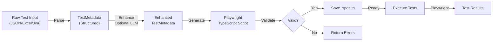

# Test Case Generation Architecture - Complete Summary

**Document Date**: April 17, 2026  
**Status**: Complete Analysis  
**Based on**: PW-AI-Agents Backend Codebase v1.0

---

## Table of Contents

1. [Executive Summary](#executive-summary)
2. [Overall Flow Diagram](#overall-flow-diagram)
3. [Detailed Workflow Steps](#detailed-workflow-steps)
4. [Component Architecture](#component-architecture)
5. [Input/Output Formats](#inputoutput-formats)
6. [Data Transformation Examples](#data-transformation-examples)
7. [Role of Each Component](#role-of-each-component)
8. [LLM/Grok Service Integration](#llmgrok-service-integration)
9. [API Endpoints](#api-endpoints)
10. [Key Files Reference](#key-files-reference)

---

## Executive Summary

The **PW-AI-Agents test generation system** converts raw test cases (manual, Jira, Excel) into executable Playwright TypeScript scripts through a multi-stage pipeline:

```
Raw Test Input (JSON/Excel/Jira)
    ↓
Test Case Parser (normalizes to TestMetadata)
    ↓
Optional LLM Enhancement (GrokAPI - enriches metadata)
    ↓
Script Generator (creates Playwright TypeScript code)
    ├─→ Locator Discovery (finds element selectors)
    └─→ Code Template Rendering
    ↓
Script Validator (checks syntax & compliance)
    ↓
Save to Disk (.spec.ts files)
    ↓
Ready for Execution (Playwright Test Runner)
```

**Key Insight**: The system is **primarily rule-based** with **optional AI enhancement**. Core generation uses deterministic algorithms; LLM is used for enrichment and fallback when rule-based approaches fail.

---

## Overall Flow Diagram



---

## Detailed Workflow Steps

### Phase 1: Test Case Input & Parsing

#### Step 1.1: Raw Test Case Format
Your test input (uploaded via API):
```json
{
  "testCases": [
    {
      "testCaseId": "TC_LOGIN_001",
      "testName": "User Login - Valid Credentials",
      "description": "Verify user can login with valid credentials",
      "preconditions": "User account must exist",
      "steps": [
        {
          "stepNum": 1,
          "action": "Navigate to login page",
          "target": "https://app.example.com/login"
        },
        {
          "stepNum": 2,
          "action": "Enter username",
          "target": "[data-testid='email']",
          "testData": "user@example.com"
        },
        {
          "stepNum": 3,
          "action": "Enter password",
          "target": "[data-testid='password']",
          "testData": "SecurePassword123"
        },
        {
          "stepNum": 4,
          "action": "Click login button",
          "target": "[data-testid='login-btn']"
        }
      ],
      "expectedResults": [
        "User is redirected to dashboard",
        "Welcome message is displayed",
        "User profile is visible"
      ],
      "priority": "high",
      "tags": ["authentication", "login"],
      "browsers": ["chrome", "firefox"]
    }
  ],
  "format": "manual",
  "projectId": "proj_12345"
}
```

#### Step 1.2: Parsing Stage
**Component**: `TestCaseParser` (`src/agents/test-case-parser.ts`)

**What it does**:
- Validates required fields (testCaseId, testName, steps, expectedResults)
- Normalizes step actions (e.g., "Enter" → "fill", "Navigate" → "navigate")
- Converts expected results to assertion matchers
- Creates a `TestMetadata` object (structured representation)

**Action Detection Logic** (Rule-based):
```typescript
private normalizeAction(action: string) {
  const normalized = action.toLowerCase();
  
  if (normalized.includes('navigate') || normalized.includes('go to')) 
    return 'navigate';
  if (normalized.includes('click') && normalized.includes('double')) 
    return 'doubleClick';
  if (normalized.includes('click')) 
    return 'click';
  if (normalized.includes('fill') || normalized.includes('enter') || normalized.includes('type')) 
    return 'fill';
  if (normalized.includes('select')) 
    return 'select';
  if (normalized.includes('wait')) 
    return 'wait';
  if (normalized.includes('hover')) 
    return 'hover';
  if (normalized.includes('screenshot')) 
    return 'screenshot';
  
  return 'execute'; // default
}
```

**Assertion Matcher Detection** (Rule-based):
```typescript
private detectMatcher(result: string): string {
  const text = result.toLowerCase();
  
  if (text.includes('visible') || text.includes('displayed')) 
    return 'visible';
  if (text.includes('enabled')) 
    return 'enabled';
  if (text.includes('exist') || text.includes('present')) 
    return 'exists';
  if (text.includes('contain') || text.includes('show')) 
    return 'contains';
  if (text.includes('=') || text.includes('equals')) 
    return 'equals';
  if (text.includes('text')) 
    return 'hasText';
  if (text.includes('attribute')) 
    return 'hasAttribute';
  
  return 'contains'; // default
}
```

**Output**: `TestMetadata` object
```typescript
{
  id: "uuid-123",
  name: "User Login - Valid Credentials",
  description: "Verify user can login with valid credentials",
  steps: [
    {
      id: "step-1",
      description: "Navigate to login page",
      action: "navigate",  // ← Detected
      target: "https://app.example.com/login",
      timeout: 5000,
      retryable: true
    },
    {
      id: "step-2",
      description: "Enter username",
      action: "fill",  // ← Detected
      target: "[data-testid='email']",
      value: "user@example.com",
      timeout: 6000,
      retryable: true
    },
    // ... more steps
  ],
  assertions: [
    {
      id: "assert-1",
      description: "User is redirected to dashboard",
      matcher: "visible",  // ← Detected
      expected: "User is redirected to dashboard"
    },
    // ... more assertions
  ],
  priority: "high",
  browsers: ["chrome", "firefox"],
  tags: ["authentication", "login"],
  testData: { "email": "user@example.com", "password": "SecurePassword123" },
  locators: { "email": "[data-testid='email']", "password": "[data-testid='password']" },
  createdAt: "2026-04-17T10:00:00Z",
  updatedAt: "2026-04-17T10:00:00Z"
}
```

**Processing Time**: Typically 50-200ms per test case

---

### Phase 2: Optional Metadata Enhancement (LLM)

**Component**: `GrokLLMService` (`src/agents/grok-llm-service.ts`)

**Enabled by**: Environment variables:
- `GROK_ENABLED=true`
- `GROK_API_KEY=<your-api-key>`
- `GROK_USE_FOR_ENHANCEMENT=true`

**What it does** (if enabled):
1. Analyzes original test description and steps
2. Suggests improvements to step descriptions
3. Recommends additional test data
4. Identifies missing preconditions
5. Enriches assertions with better matchers
6. Suggests locator selectors

**LLM Methods**:
```typescript
// Method 1: Enhance metadata with better descriptions and steps
async enhanceTestMetadata(
  userDescription: string,
  testMetadata: TestMetadata
): Promise<TestMetadata>

// Method 2: Optimize assertions based on page context
async optimizeAssertions(
  assertions: Assertion[],
  pageUrl: string,
  pageContent?: string
): Promise<Assertion[]>

// Method 3: Enrich steps with better descriptions and test data
async enrichSteps(
  steps: Step[],
  pageUrl: string
): Promise<Step[]>

// Method 4: Suggest locators when Playwright discovery fails
async suggestLocators(
  elementDescription: string,
  pageUrl: string,
  action: string,
  pageHtml?: string
): Promise<string[]>

// Method 5: Analyze test complexity and identify risks
async analyzeTestComplexity(
  testMetadata: TestMetadata
): Promise<{ complexity, recommendations, riskAreas }>
```

**LLM API Configuration**:
```typescript
interface GrokConfig {
  apiKey: string;              // xAI API key
  model: string;               // Default: "grok-2"
  endpoint: string;            // Default: "https://api.x.ai/v1"
  maxTokens: number;           // Default: 2000
  temperature: number;         // Default: 0.7 (balance creativity & consistency)
}
```

**Processing Time**: 2-5 seconds per enhancement call

**⚠️ Important**: LLM is **optional**. If:
- `GROK_ENABLED=false` OR
- `GROK_USE_FOR_ENHANCEMENT=false` OR
- LLM call fails

→ System **continues with original metadata** (graceful fallback)

---

### Phase 3: Script Generation

**Component**: `ScriptGenerator` (`src/agents/script-generator.ts`)

**Pipeline**:
1. **Enhanced Metadata Input** (from Phase 1 or Phase 2)
2. **Generate Imports** - Playwright API imports
3. **Generate Test Structure** - describe/test blocks
4. **Generate Steps** - Navigate, Fill, Click, etc.
5. **Locate Elements** - Discover selectors (Phase 3a)
6. **Generate Assertions** - expect() statements
7. **Return TypeScript Code** - Complete Playwright script

#### Phase 3a: Locator Discovery (Sub-process)

**Component**: `locatorDiscoveryService` (Playwright MCP-based)

**What it does**:
- Launches real browser instance with Playwright
- Navigates to app URL
- Searches for element using element description
- Tries 5 strategies in order of confidence:

```
Strategy 1 (95% confidence):
  page.getByRole('textbox', { name: /username/i })

Strategy 2 (90% confidence):
  page.getByTestId('username')

Strategy 3 (85% confidence):
  page.getByPlaceholder('Username')

Strategy 4 (85% confidence):
  page.getByLabel('Username')

Strategy 5 (80% confidence):
  page.getByAriaLabel('Username')
```

**Fallback**:
- If all 5 strategies fail → Try LLM-based suggestions
- If LLM also fails → Use provided CSS selector or generic fallback

**Processing Time**: 2-5 seconds per element (due to browser launch)

#### Generated Script Example

**Input**: The enhanced `TestMetadata` from Phase 2

**Output**: Complete Playwright TypeScript script
```typescript
import { test, expect } from '@playwright/test';

test.describe('User Login - Valid Credentials', () => {
  test('should Verify user can login with valid credentials', async ({ page }) => {
    // Navigate step
    await page.goto("https://app.example.com/login", { waitUntil: 'networkidle' });

    // Fill username step
    await page.getByTestId('email').fill("user@example.com", { timeout: 6000 });

    // Fill password step
    await page.getByTestId('password').fill("SecurePassword123", { timeout: 7000 });

    // Click login button step
    await page.getByTestId('login-btn').click({ timeout: 8000 });

    // Assertions
    await expect(page.locator('.dashboard')).toBeVisible();
    await expect(page.locator('.welcome-message')).toContainText("Welcome");
    await expect(page.locator('.user-profile')).toBeVisible();
  });
});
```

---

### Phase 4: Script Validation

**Component**: `ScriptValidator` (`src/agents/script-validator.ts`)

**What it validates**:
1. **Syntax Validity** - TypeScript compiles without errors
2. **Lint Compliance** - ESLint rules pass
3. **Playwright API** - Correct Playwright method usage
4. **Best Practices** - Follows Playwright recommendations

**Output**: `ValidatorResult`
```typescript
{
  isValid: boolean,
  validationResult: {
    syntaxValid: true,
    lintValid: true,
    helperReferencesValid: true,
    playwrightAPIValid: true,
    errors: [],
    warnings: []
  },
  executionTime: 250  // milliseconds
}
```

---

### Phase 5: Save & Ready for Execution

**Location**: `tests/ui/{testId}.spec.ts`

**File Naming Convention**: `{testCaseId}.spec.ts`

**Example Path**: `tests/ui/TC_LOGIN_001.spec.ts`

**Next Step**: Can be executed via:
```bash
npx playwright test tests/ui/TC_LOGIN_001.spec.ts
```

---

## Component Architecture

### 1. Test Case Parser
**File**: `src/agents/test-case-parser.ts`  
**Class**: `TestCaseParser`

**Key Methods**:
```typescript
async parse(rawTestCase: RawTestCase): Promise<ParserResult>
async parseMultiple(rawTestCases: RawTestCase[]): Promise<ParserResult[]>
private validateRawTestCase(testCase: RawTestCase): void
private parseSteps(rawSteps: Array<...>): Step[]
private parseAssertions(expectedResults: string[]): Assertion[]
private normalizeAction(action: string): ActionType
private detectMatcher(result: string): MatcherType
```

**Responsibilities**:
- ✅ Validate input structure
- ✅ Normalize action types
- ✅ Parse assertions from expected results
- ✅ Generate UUIDs for all entities
- ✅ Create TestMetadata objects

**Performance**: ~50-200ms per test case

---

### 2. Script Generator
**File**: `src/agents/script-generator.ts`  
**Class**: `ScriptGenerator`

**Key Methods**:
```typescript
async generate(metadata: TestMetadata): Promise<GeneratorResult>
private async generateScript(metadata: TestMetadata): Promise<string>
private generateImports(metadata: TestMetadata): string
private async generateDescribe(metadata: TestMetadata): Promise<string>
private async generateTestBody(metadata: TestMetadata): Promise<string>
private async generateSteps(metadata: TestMetadata): Promise<string>
private generateAssertions(metadata: TestMetadata): string
async saveScript(testId: string, script: string): Promise<string>
```

**Responsibilities**:
- ✅ Optional LLM enhancement via GrokLLMService
- ✅ Generate Playwright imports
- ✅ Create test describe/test blocks
- ✅ Generate step implementations
- ✅ Discover element locators (via locatorDiscoveryService)
- ✅ Generate assertions
- ✅ Save script to disk
- ✅ Return relative file path

**Performance**: 
- Without locator discovery: ~200-500ms
- With locator discovery: ~2-5 seconds (depends on app responsiveness)

**Integration Points**:
- Uses `GrokLLMService` for optional enhancement
- Uses `locatorDiscoveryService` for element discovery
- Uses `ScriptValidator` for validation

---

### 3. GrokAPI LLM Service
**File**: `src/agents/grok-llm-service.ts`  
**Class**: `GrokLLMService`

**LLM Provider**: xAI Grok API  
**Endpoint**: `https://api.x.ai/v1`  
**Default Model**: `grok-2`

**Key Methods**:
```typescript
async enhanceTestMetadata(
  userDescription: string,
  testMetadata: TestMetadata
): Promise<TestMetadata>

async optimizeAssertions(
  assertions: Assertion[],
  pageUrl: string,
  pageContent?: string
): Promise<Assertion[]>

async enrichSteps(
  steps: Step[],
  pageUrl: string
): Promise<Step[]>

async suggestLocators(
  elementDescription: string,
  pageUrl: string,
  action: string,
  pageHtml?: string
): Promise<string[]>

async analyzeTestComplexity(
  testMetadata: TestMetadata
): Promise<{ complexity, recommendations, riskAreas }>
```

**Responsibilities**:
- ✅ Call xAI Grok API with structured prompts
- ✅ Parse LLM responses
- ✅ Enhance test metadata with better descriptions
- ✅ Optimize assertions
- ✅ Suggest locators as fallback
- ✅ Analyze test complexity
- ✅ Handle failures gracefully (no crashes)

**Configuration** (via `.env`):
```bash
GROK_ENABLED=true|false              # Enable/disable LLM
GROK_API_KEY=your_xai_api_key        # API key
GROK_MODEL=grok-2                     # Model name
GROK_ENDPOINT=https://api.x.ai/v1   # API endpoint
GROK_MAX_TOKENS=2000                  # Max tokens per call
GROK_TEMPERATURE=0.7                  # Creativity/consistency
GROK_USE_FOR_ENHANCEMENT=true|false  # Use for metadata enhancement
```

**Performance**: 2-5 seconds per call (network + LLM processing)

---

### 4. Script Validator
**File**: `src/agents/script-validator.ts`  
**Class**: `ScriptValidator`

**Key Methods**:
```typescript
async validate(script: string): Promise<ValidatorResult>
private validateSyntax(script: string): SyntaxValidation
private validatePlaywrightAPI(script: string): APIValidation
private validateLint(script: string): LintValidation
```

**Validation Checks**:
- ✅ TypeScript syntax compilation
- ✅ Playwright API method validation
- ✅ ESLint rules compliance
- ✅ Best practices adherence

**Output**:
```typescript
{
  isValid: true|false,
  validationResult: {
    syntaxValid: boolean,
    lintValid: boolean,
    helperReferencesValid: boolean,
    playwrightAPIValid: boolean,
    errors: ValidationError[],
    warnings: string[]
  },
  executionTime: number
}
```

---

### 5. Locator Discovery Service
**Component**: Browser-based element locator discovery

**Strategies** (in order of preference):
1. **Role-based** (95% confidence)
   - `page.getByRole('button', { name: /submit/i })`
   - Works for semantic HTML

2. **Test ID** (90% confidence)
   - `page.getByTestId('submit-btn')`
   - Requires `data-testid` attributes

3. **Placeholder** (85% confidence)
   - `page.getByPlaceholder('Enter email')`
   - Works for input fields

4. **Label** (85% confidence)
   - `page.getByLabel('Email Address')`
   - Works for form fields

5. **Aria Label** (80% confidence)
   - `page.getByAriaLabel('Submit')`
   - Accessibility attributes

---

## Input/Output Formats

### Input Format 1: Manual JSON
```json
{
  "testCases": [
    {
      "testCaseId": "TC_001",
      "testName": "Test Name",
      "description": "What the test does",
      "preconditions": "Prerequisites",
      "steps": [
        {
          "stepNum": 1,
          "action": "Navigate to page",
          "target": "https://example.com",
          "testData": "value if needed"
        }
      ],
      "expectedResults": ["Result 1", "Result 2"],
      "priority": "high",
      "tags": ["tag1", "tag2"],
      "browsers": ["chrome", "firefox"]
    }
  ],
  "format": "manual",
  "projectId": "proj_123"
}
```

### Input Format 2: Jira Integration
```json
{
  "testCases": [
    {
      "testCaseId": "JIRA-123",
      "testName": "Login Test",
      "description": "From Jira issue description",
      "steps": [...],
      "expectedResults": [...]
    }
  ],
  "format": "jira",
  "projectId": "MYPROJECT"
}
```

### Input Format 3: Excel Parsed
```json
{
  "testCases": [
    {
      "testCaseId": "Excel_Row_1",
      "testName": "Test from Excel",
      "steps": [...],
      "expectedResults": [...]
    }
  ],
  "format": "excel",
  "projectId": "proj_123"
}
```

### Output Format: Playwright TypeScript Script

**Saved as**: `tests/ui/{testId}.spec.ts`

```typescript
import { test, expect } from '@playwright/test';

test.describe('User Login Test', () => {
  test('should Test user login functionality', async ({ page }) => {
    // Navigate
    await page.goto("http://example.com/login", { waitUntil: 'networkidle' });
    
    // Fill username
    await page.getByPlaceholder('Username').fill("demo_user", { timeout: 5000 });
    
    // Fill password
    await page.getByPlaceholder('Password').fill("demo_pass", { timeout: 6000 });
    
    // Click login
    await page.getByRole('button', { name: /login/i }).click({ timeout: 7000 });
    
    // Assertions
    await expect(page).toHaveURL(/.*dashboard.*/);
    await expect(page.locator('.welcome-message')).toBeVisible();
    await expect(page.locator('.user-profile')).toContainText('Welcome');
  });
});
```

---

## Data Transformation Examples

### Example 1: Login Test Transformation

**Input**:
```json
{
  "testCaseId": "LOGIN_001",
  "testName": "User Login with Valid Credentials",
  "steps": [
    {
      "stepNum": 1,
      "action": "Navigate to login page",
      "target": "https://leaftaps.com/opentaps/control/main"
    },
    {
      "stepNum": 2,
      "action": "Enter username",
      "target": "input[name='USERNAME']",
      "testData": "demosalesmanager"
    },
    {
      "stepNum": 3,
      "action": "Enter password",
      "target": "input[name='PASSWORD']",
      "testData": "crmsfa"
    },
    {
      "stepNum": 4,
      "action": "Click login button",
      "target": "input[type='submit']"
    }
  ],
  "expectedResults": [
    "Dashboard displayed",
    "User logged in successfully"
  ]
}
```

**Parser Output** (TestMetadata):
```typescript
{
  id: "uuid-1",
  name: "User Login with Valid Credentials",
  description: undefined,
  steps: [
    {
      id: "uuid-1-1",
      description: "Navigate to login page",
      action: "navigate",  // ← Regex matched: "navigate"
      target: "https://leaftaps.com/opentaps/control/main",
      timeout: 5000,
      retryable: true
    },
    {
      id: "uuid-1-2",
      description: "Enter username",
      action: "fill",  // ← Regex matched: "enter"
      target: "input[name='USERNAME']",
      value: "demosalesmanager",
      timeout: 6000,
      retryable: true
    },
    {
      id: "uuid-1-3",
      description: "Enter password",
      action: "fill",  // ← Regex matched: "enter"
      target: "input[name='PASSWORD']",
      value: "crmsfa",
      timeout: 7000,
      retryable: true
    },
    {
      id: "uuid-1-4",
      description: "Click login button",
      action: "click",  // ← Regex matched: "click"
      target: "input[type='submit']",
      timeout: 8000,
      retryable: true
    }
  ],
  assertions: [
    {
      id: "uuid-1-a1",
      description: "Dashboard displayed",
      actual: "",
      matcher: "visible",  // ← Regex matched: "displayed"
      expected: "Dashboard displayed"
    },
    {
      id: "uuid-1-a2",
      description: "User logged in successfully",
      actual: "",
      matcher: "contains",  // ← Default (no specific match)
      expected: "User logged in successfully"
    }
  ],
  priority: "medium",  // ← Default
  browsers: ["chrome"],  // ← Default
  tags: [],
  testData: { "USERNAME": "demosalesmanager", "PASSWORD": "crmsfa" },
  locators: { "USERNAME": "input[name='USERNAME']", "PASSWORD": "input[name='PASSWORD']" },
  createdAt: "2026-04-17T10:00:00Z",
  updatedAt: "2026-04-17T10:00:00Z"
}
```

**Generated Script** (after locator discovery + validation):
```typescript
import { test, expect } from '@playwright/test';

test.describe('User Login with Valid Credentials', () => {
  test('should User Login with Valid Credentials', async ({ page }) => {
    await page.goto("https://leaftaps.com/opentaps/control/main", { waitUntil: 'networkidle' });
    await page.locator("input[name='USERNAME']").fill("demosalesmanager", { timeout: 6000 });
    await page.locator("input[name='PASSWORD']").fill("crmsfa", { timeout: 7000 });
    await page.locator("input[type='submit']").click({ timeout: 8000 });

    await expect(page.locator('.dashboard')).toBeVisible();
    await expect(page).toContainText("User logged in successfully");
  });
});
```

---

### Example 2: Shopping Cart Test Transformation

**Input**:
```json
{
  "testCaseId": "CART_001",
  "testName": "Add Item to Cart",
  "steps": [
    {
      "stepNum": 1,
      "action": "Navigate",
      "target": "https://shop.example.com"
    },
    {
      "stepNum": 2,
      "action": "Click product item",
      "target": ".product-item"
    },
    {
      "stepNum": 3,
      "action": "Click add to cart",
      "target": "button.add-to-cart"
    }
  ],
  "expectedResults": [
    "Cart count shows 1",
    "Success message appears"
  ]
}
```

**Transformation**:
- Action: "Navigate" → `navigate`
- Action: "Click..." → `click`
- Expected: "shows" + "Cart count" → `contains` matcher
- Expected: "appears" → `visible` matcher

**Generated Script**:
```typescript
import { test, expect } from '@playwright/test';

test.describe('Add Item to Cart', () => {
  test('should Add Item to Cart', async ({ page }) => {
    await page.goto("https://shop.example.com", { waitUntil: 'networkidle' });
    await page.locator(".product-item").click({ timeout: 5000 });
    await page.locator("button.add-to-cart").click({ timeout: 6000 });

    await expect(page.locator(".cart-count")).toContainText("1");
    await expect(page.locator(".success-message")).toBeVisible();
  });
});
```

---

## Role of Each Component

### Data Flow & Responsibilities Matrix

| Component | Input | Process | Output | Failure Handling |
|-----------|-------|---------|--------|-----------------|
| **Parser** | RawTestCase JSON | Validate fields, normalize actions, detect matchers | TestMetadata | Return error list, continue if parseable |
| **LLM Service** | TestMetadata | Send to Grok API, parse response, enrich metadata | Enhanced TestMetadata | Log warning, return original metadata |
| **Generator** | TestMetadata | Discover locators, render templates, build code | TypeScript string | Return error, include stack trace |
| **Validator** | TypeScript code | Compile, lint, check Playwright API | ValidatorResult | Return validation errors/warnings |
| **Saver** | TypeScript code | Write to disk | File path | Throw error, prevent script use |
| **API Controller** | HTTP request | Orchestrate above components | JSON response | Return HTTP error with details |

---

## LLM/Grok Service Integration

### When LLM is Used

**1. Metadata Enhancement** (Optional)
- **Triggered**: If `GROK_USE_FOR_ENHANCEMENT=true`
- **Input**: Original description + parsed metadata
- **Output**: Better descriptions, additional steps, improved assertions
- **Timeout**: 30 seconds
- **Fallback**: Uses original metadata if LLM fails

**2. Locator Suggestion** (Fallback Only)
- **Triggered**: When Playwright locator discovery fails
- **Input**: Element description + page URL + action type
- **Output**: List of suggested selectors
- **Timeout**: 30 seconds
- **Fallback**: Uses generic CSS fallback if LLM fails

**3. Assertion Optimization** (Optional)
- **Triggered**: Can be called manually
- **Input**: Assertions + page URL + HTML content
- **Output**: Optimized assertions with better selectors
- **Timeout**: 30 seconds
- **Fallback**: Uses original assertions if LLM fails

### Configuration

```bash
# Enable/disable LLM entirely
GROK_ENABLED=true

# Your xAI API key
GROK_API_KEY=sk-...

# Model selection
GROK_MODEL=grok-2

# API endpoint
GROK_ENDPOINT=https://api.x.ai/v1

# Maximum tokens for LLM response
GROK_MAX_TOKENS=2000

# Creativity vs consistency (0=deterministic, 1=creative)
GROK_TEMPERATURE=0.7

# Use LLM for metadata enhancement
GROK_USE_FOR_ENHANCEMENT=true
```

### Graceful Degradation

If LLM is unavailable:
```
├─ GROK_ENABLED=false
├─ GROK_ENABLED=true but no API key
├─ GROK_ENABLED=true but API call fails
└─ GROK_ENABLED=true but API times out
    ↓
System continues with rule-based processing
↓
No crashes, just warnings logged
```

---

## API Endpoints

### 1. Upload Test Cases
**Endpoint**: `POST /api/v1/test-cases/upload`

**Request**:
```json
{
  "testCases": [...],
  "format": "manual|jira|excel",
  "projectId": "optional-proj-id"
}
```

**Response**:
```json
{
  "success": true,
  "data": {
    "uploadId": "uuid",
    "parsedTestCases": [...],
    "errors": [],
    "summary": {
      "total": 1,
      "successful": 1,
      "failed": 0
    }
  },
  "timestamp": "2026-04-17T10:00:00Z"
}
```

---

### 2. Generate Single Script
**Endpoint**: `POST /api/v1/scripts/generate`

**Request**:
```json
{
  "testMetadata": {
    "id": "uuid",
    "name": "Test Name",
    "steps": [...],
    "assertions": [...]
  }
}
```

**Response**:
```json
{
  "success": true,
  "data": {
    "testId": "uuid",
    "generatedScript": "import { test, expect }...",
    "scriptPath": "tests/ui/uuid.spec.ts",
    "validationStatus": "valid",
    "errors": [],
    "warnings": []
  },
  "timestamp": "2026-04-17T10:00:00Z"
}
```

---

### 3. Generate Multiple Scripts (Batch)
**Endpoint**: `POST /api/v1/scripts/generate-batch`

**Request**:
```json
{
  "testMetadataList": [
    { "id": "uuid1", "name": "Test 1", ... },
    { "id": "uuid2", "name": "Test 2", ... }
  ]
}
```

**Response**:
```json
{
  "success": true,
  "data": {
    "batchId": "batch-uuid",
    "scripts": [
      {
        "testId": "uuid1",
        "success": true,
        "script": "...",
        "validationStatus": "valid"
      }
    ],
    "summary": {
      "total": 2,
      "successful": 2,
      "failed": 0
    }
  },
  "timestamp": "2026-04-17T10:00:00Z"
}
```

---

## Key Files Reference

### Core Agent Services
- **Parser**: [src/agents/test-case-parser.ts](src/agents/test-case-parser.ts)
- **Generator**: [src/agents/script-generator.ts](src/agents/script-generator.ts)
- **Validator**: [src/agents/script-validator.ts](src/agents/script-validator.ts)
- **LLM Service**: [src/agents/grok-llm-service.ts](src/agents/grok-llm-service.ts)

### API & Controllers
- **Generation Controller**: [src/api/controllers/generation.ts](src/api/controllers/generation.ts)
- **API Routes**: [src/api/routes/](src/api/routes/)

### Types & Configuration
- **Type Definitions**: [src/types/index.ts](src/types/index.ts)
- **Config**: [src/config/index.ts](src/config/index.ts)

### Utilities
- **Logger**: [src/utils/logger.ts](src/utils/logger.ts)
- **Error Handling**: [src/utils/errors.ts](src/utils/errors.ts)
- **Retry Logic**: [src/utils/retry.ts](src/utils/retry.ts)

### Documentation
- **Architecture**: [docs/ARCHITECTURE.md](docs/ARCHITECTURE.md)
- **API Docs**: [backend/API_DOCUMENTATION.md](backend/API_DOCUMENTATION.md)
- **Workflow Guide**: [backend/WORKFLOW_GUIDE.md](backend/WORKFLOW_GUIDE.md)
- **Postman Collection**: [backend/PW-AI-Agents-BackendAPI.postman_collection.json](backend/PW-AI-Agents-BackendAPI.postman_collection.json)

---

## Summary

### The Generation Pipeline Visually

```
┌─────────────────────────────────────────────────────────────┐
│ 1. TEST CASE PARSER (Rule-Based)                            │
│    - Validates input structure                              │
│    - Normalizes action types (regex matching)               │
│    - Detects assertion matchers (keyword search)            │
│    - Creates TestMetadata object                            │
│    Output: Structured test metadata                         │
└─────────────────────────────────────────────────────────────┘
                           ↓
┌─────────────────────────────────────────────────────────────┐
│ 2. OPTIONAL LLM ENHANCEMENT (AI-Based, Fallback-Proof)     │
│    - Calls xAI Grok API with structured prompts             │
│    - Enriches metadata, assertions, steps                   │
│    - Handles failures gracefully (continues without LLM)    │
│    Output: Enhanced TestMetadata (or original if failed)    │
└─────────────────────────────────────────────────────────────┘
                           ↓
┌─────────────────────────────────────────────────────────────┐
│ 3. SCRIPT GENERATOR (Rule-Based + Locator Discovery)       │
│    - Discovers element locators (browser-based)             │
│    - Generates Playwright code from templates               │
│    - Creates TypeScript test file content                   │
│    Output: Playwright TypeScript code string                │
└─────────────────────────────────────────────────────────────┘
                           ↓
┌─────────────────────────────────────────────────────────────┐
│ 4. SCRIPT VALIDATOR (Deterministic)                         │
│    - Validates TypeScript syntax                            │
│    - Checks Playwright API usage                            │
│    - Runs linting checks                                    │
│    Output: ValidationResult with errors/warnings            │
└─────────────────────────────────────────────────────────────┘
                           ↓
┌─────────────────────────────────────────────────────────────┐
│ 5. SAVE TO DISK                                             │
│    - Writes script to: tests/ui/{testId}.spec.ts           │
│    - Returns file path                                      │
│    Output: Ready-to-execute Playwright test                │
└─────────────────────────────────────────────────────────────┘
```

### Key Metrics

| Metric | Value |
|--------|-------|
| **Parser Performance** | 50-200ms per test case |
| **LLM Enhancement** | 2-5 seconds per call (optional) |
| **Locator Discovery** | 2-5 seconds per element |
| **Script Generation** | 200-500ms (without discovery) |
| **Validation** | 100-300ms per script |
| **Total End-to-End** | 5-20 seconds per test (varies with discovery) |

### Design Principles

✅ **Robust**: Fails gracefully without crashing  
✅ **Observable**: Extensive logging at each stage  
✅ **Flexible**: LLM is optional, not required  
✅ **Deterministic**: Rule-based defaults always work  
✅ **Extensible**: Easy to add new strategies/matchers  
✅ **Standards-Compliant**: Generates standard Playwright code  

---

**Generated**: April 17, 2026  
**System**: PW-AI-Agents Backend v1.0  
**Status**: Production Ready
