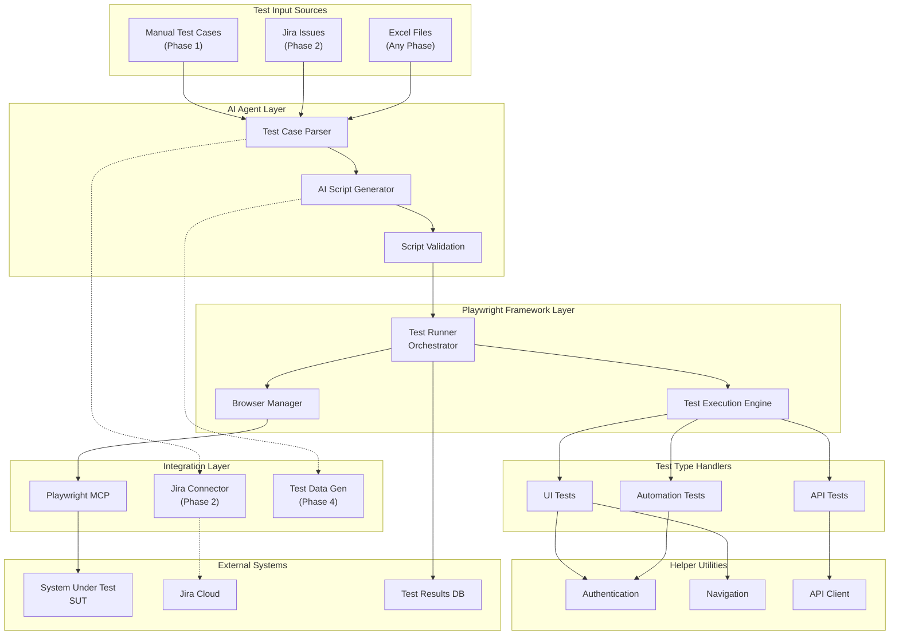
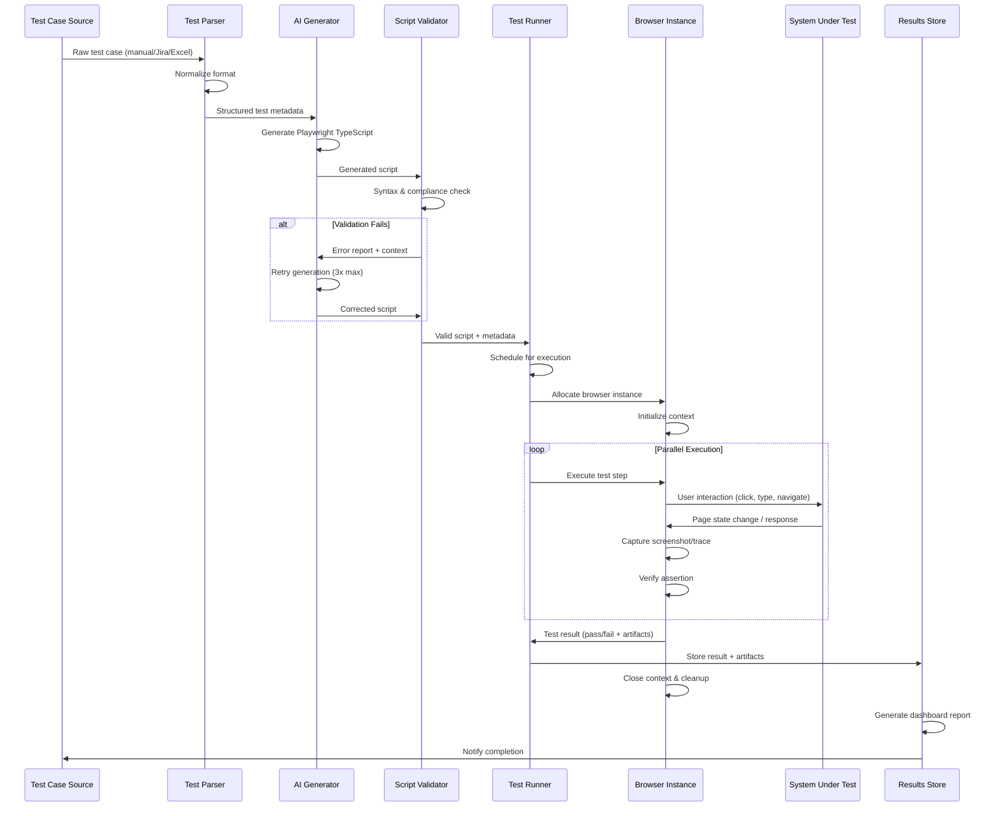
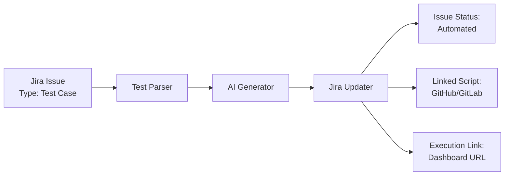

# PW-AI-Agents: Enterprise Architecture

**Version**: 1.0  
**Last Updated**: April 2026  
**Status**: Active Development (Phase 1)  
**Audience**: Development Teams, Technical Leadership

---

## Table of Contents

1. [Executive Overview](#executive-overview)
2. [System Architecture](#system-architecture)
3. [Component Architecture](#component-architecture)
4. [Data Models & Contracts](#data-models--contracts)
5. [Execution Flow & Orchestration](#execution-flow--orchestration)
6. [Scalability & Performance](#scalability--performance)
7. [Reliability & Error Handling](#reliability--error-handling)
8. [Integration Points](#integration-points)
9. [Security & Compliance](#security--compliance)
10. [Deployment & Infrastructure](#deployment--infrastructure)
11. [Development Workflow](#development-workflow)
12. [Roadmap & Future Phases](#roadmap--future-phases)

---

## Executive Overview

### Purpose

The **PW-AI-Agents** system is an intelligent test automation platform designed to dramatically accelerate test script generation and execution. The platform leverages AI agents to automatically convert manual test case specifications into executable Playwright TypeScript scripts, eliminating manual coding overhead and standardizing test implementation across the organization.

### Key Value Propositions

| Value Proposition | Benefit |
|---|---|
| **Automated Script Generation** | Reduce time from test case to executable script from days to minutes |
| **AI-Driven Quality Assurance** | Intelligent test case understanding and framework-compliant code generation |
| **Scalable Test Execution** | Parallel execution of UI, API, and automation tests across multiple browsers |
| **Self-Healing Tests** | Auto-remediation of test failures through intelligent locator discovery (Phase 3) |
| **Unified Test Strategy** | Standardized test patterns, consistent methodology, comprehensive test coverage |
| **Test Intelligence Dashboard** | Real-time reporting, trend analysis, defect correlation |

### Strategic Goals

1. **70% Success Rate** — 70% of AI-generated scripts execute successfully on first attempt
2. **Reduced Test Development Cycle** — 80% reduction in test automation time-to-delivery
3. **Enterprise Scalability** — Support 1000+ concurrent test executions across distributed environments
4. **Maintainability** — Automated detection and remediation of broken tests (auto-healing)
5. **Intelligence** — Intelligent test data generation and Jira-driven test case orchestration

---

## System Architecture

### High-Level Architecture Diagram



### Component Interaction Matrix

| Component | Responsibility | Dependencies | Output |
|---|---|---|---|
| **Test Input Parser** | Read & normalize test case specs | Excel, Jira API | Structured test metadata |
| **AI Script Generator** | Convert test logic to Playwright code | LLM service, framework templates | TypeScript script |
| **Script Validator** | Verify syntax & framework compliance | TypeScript compiler, linter | Validated script |
| **Test Runner** | Orchestrate test execution | Playwright Core, helpers | Test execution queue |
| **Browser Manager** | Manage browser instances & context | Playwright/MCP | Browser session pool |
| **Test Execution Engine** | Execute individual tests | Helpers, SUT connection | Test result object |
| **Helper Utilities** | Provide reusable test functions | Playwright API | Helper methods |
| **Playwright MCP** | Connect to SUT, retrieve DOM | MCP protocol | DOM snapshots, interaction results |
| **Jira Connector** | Fetch/update test cases & results | Jira REST API | Test metadata, status updates |
| **Test Data Generator** | Create realistic test data | Faker library, data patterns | Test data fixtures |

---

## Component Architecture

### 1. Test Framework Layer

#### Purpose
Organize and execute tests across three distinct categories, each with specific patterns and helpers.

#### Structure

```
tests/
├── ui/                 # UI/E2E test specifications
│   └── login-ui.spec.ts
├── api/                # API integration test specifications
│   └── test-api.spec.ts
└── automation/         # Complex automation workflows
```

#### UI Tests (`tests/ui/`)
- **Purpose**: End-to-end browser automation, user interaction simulation
- **Test Type**: Full browser context, visual validation, user journey testing
- **Dependencies**: Navigation helper, Authentication helper
- **Browser Contexts**: Chrome, Firefox, Safari (configurable in playwright.config.ts)
- **Success Metric**: > 90% pass rate expected (human-written baseline)

#### API Tests (`tests/api/`)
- **Purpose**: Direct HTTP API testing without browser automation
- **Test Type**: REST/GraphQL endpoint validation, contract testing
- **Dependencies**: API client helper, authentication
- **No Browser**: Direct HTTP requests, faster execution
- **Success Metric**: > 95% pass rate expected (API stability higher than UI)

#### Automation Tests (`tests/automation/`)
- **Purpose**: Complex multi-step workflows, cross-browser compatibility
- **Test Type**: Advanced user scenarios, data-driven tests, load simulation
- **Dependencies**: All helpers (auth, navigation, API)
- **Parallel Execution**: Multiple browser instances
- **Success Metric**: Depends on test complexity

### 2. AI Agent Layer

#### Test Case Parser
- **Input**: Unstructured test case (manual docs, Jira ticket, Excel)
- **Processing**:
  - Extract test steps, expected results, test data requirements
  - Identify locator hints and browser compatibility needs
  - Normalize into structured metadata (JSON schema)
- **Output**: 
  ```typescript
  {
    testId: string;
    testName: string;
    description: string;
    steps: Array<{action: string; target?: string; value?: string}>;
    testData: Record<string, unknown>;
    expectedResults: string[];
    tags: string[];
    locatorStrategy: 'xpath' | 'css' | 'role' | 'text';
  }
  ```

#### AI Script Generator
- **Input**: Parsed test case metadata + framework context
- **AI Model**: LLM agent with Playwright/TypeScript fine-tuning
- **Processing**:
  - Generate TypeScript code following framework patterns
  - Ensure proper helper library usage
  - Embed locator discovery strategy
  - Structure for maintainability
- **Output**: 
  ```typescript
  // Generated test file following Project patterns
  import { test, expect } from '@playwright/test';
  import { AuthHelper } from '../helpers/auth';
  
  test('User Login - Valid Credentials', async ({ page }) => {
    // Auto-generated test implementation
  });
  ```

#### Script Validator
- **Input**: Generated TypeScript script
- **Validation Steps**:
  1. **Syntax Check**: TypeScript compiler pass
  2. **Linting**: ESLint compliance (if configured)
  3. **Helper References**: All imported helpers exist & match signatures
  4. **Playwright API**: All Playwright method calls are valid
  5. **Structure**: Proper test naming, describe blocks (if needed)
- **Output**: Validation report with pass/fail + specific error details
- **Failure Action**: Return error details to AI agent for retry/correction

### 3. Helper Utilities Layer

#### Authentication Helper (`helpers/auth.ts`)
**Purpose**: Centralized authentication logic for test setup

```typescript
// Typical interface
export class AuthHelper {
  async login(page, credentials): Promise<void>;
  async logout(page): Promise<void>;
  async isAuthenticated(page): Promise<boolean>;
}
```

**Usage Patterns**:
- Test setup phase for authenticated tests
- Session management across test instances
- Multi-user test scenarios

#### Navigation Helper (`helpers/navigation.ts`)
**Purpose**: Standardized page navigation and URL handling

```typescript
// Typical interface
export class NavigationHelper {
  async navigateTo(page, url): Promise<void>;
  async getCurrentUrl(page): Promise<string>;
  async waitForNavigation(page): Promise<void>;
}
```

**Usage Patterns**:
- Cross-browser URL navigation
- Handle redirects consistently
- Base URL configuration per environment

#### API Client Helper (`helpers/api.ts`)
**Purpose**: HTTP request abstraction for API testing

```typescript
// Typical interface
export class ApiClient {
  async get(endpoint, options?): Promise<Response>;
  async post(endpoint, body, options?): Promise<Response>;
  async authenticate(): Promise<void>;
}
```

**Usage Patterns**:
- Direct API test execution
- Shared request configuration
- Response validation helpers

### 4. Integration Layer

#### Playwright MCP Connection
- **Protocol**: Model Context Protocol (MCP)
- **Purpose**: Bridge between AI agent and SUT application
- **Capabilities**:
  - Real-time DOM interrogation (fetch current DOM state)
  - User action execution (click, type, navigate)
  - Visual validation (screenshot capture)
  - JavaScript execution in page context
- **Bidirectional Flow**:
  - Agent → MCP: "What elements are on page X?"
  - MCP → Agent: DOM snapshot with locators
  - Agent → MCP: "Click button with text 'Submit'"
  - MCP → Agent: Execution result + new DOM state

#### Jira Connector (Phase 2)
- **REST API Integration**: Jira Cloud API
- **Capabilities**:
  - Fetch test cases from Jira issues
  - Update issue status with test results
  - Link generated scripts to issues
  - Track automation coverage percentage
- **Data Flow**:
  1. Query Jira for issues tagged "test-case"
  2. Extract test steps from issue description
  3. Parse Gherkin syntax if present
  4. Link generated scripts to issue
  5. Update issue status to "Automated"

#### Test Data Generator (Phase 4)
- **Library**: Faker.js for synthetic data
- **Purpose**: Generate realistic test data fixtures
- **Integration**: Lazy detection from test case specs
- **Data Categories**:
  - User credentials (email, password patterns)
  - Company information
  - Transaction data
  - Timestamps and sequences

### 5. Orchestration & Execution Layer

#### Test Runner Orchestrator
- **Role**: Central coordination of test execution
- **Responsibilities**:
  1. Load test configuration from `playwright.config.ts`
  2. Discover generated & manual test files
  3. Parallelize execution based on available resources
  4. Manage browser pool and context lifecycle
  5. Aggregate and publish results
- **Execution Commands** (from package.json):
  - `npm run test` — Run all tests
  - `npm run test:ui` — Run UI tests only
  - `npm run test:api` — Run API tests only
  - `npm run test:automation` — Run automation tests only
  - `npm run test:headed` — Run in headed mode (debug)

#### Configuration Management (`playwright.config.ts`)
- **Browser Targets**: Chrome, Firefox, Safari, mobile Chrome/Safari
- **Parallelization**: 4+ concurrent worker processes
- **Retries**: Configured by test type (UI: 2 retries, API: 1 retry)
- **Timeouts**: Page load (30s), test execution (60s), expect (5s)
- **Reporter**: HTML report, JUnit XML (CI/CD), stdout summary

---

## Data Models & Contracts

### Input Contracts

#### Test Case Input Format (Phase 1)
**Source**: Manual test case document or Excel

```json
{
  "testCaseId": "TC_001",
  "testName": "User Login with Valid Credentials",
  "description": "Verify user can login with valid email and password",
  "preconditions": "User account exists in system, user not already logged in",
  "steps": [
    {"stepNum": 1, "action": "Navigate to login page"},
    {"stepNum": 2, "action": "Enter email", "testData": "user@example.com"},
    {"stepNum": 3, "action": "Enter password", "testData": "password123"},
    {"stepNum": 4, "action": "Click login button"},
    {"stepNum": 5, "action": "Wait for dashboard to load"}
  ],
  "expectedResults": [
    "User is redirected to dashboard",
    "User name displayed in header",
    "No error messages shown"
  ],
  "testData": {
    "validEmail": "user@example.com",
    "validPassword": "password123"
  },
  "locatorHints": {
    "emailField": "input[type=email]",
    "passwordField": "input[type=password]",
    "loginButton": "button:has-text('Login')"
  },
  "browsers": ["chrome", "firefox"],
  "priority": "high",
  "tags": ["smoke", "authentication", "critical"]
}
```

#### Jira Test Case Input (Phase 2)
**Source**: Jira issue with custom fields

```
Issue: TEST-001
Type: Test Case
Status: Ready for Automation
Summary: User Login with Valid Credentials

Description:
Gherkin Syntax:
  Feature: User Authentication
    Scenario: User Login with Valid Credentials
      Given user is on login page
      When user enters valid email "user@example.com"
      And user enters valid password "password123"
      And user clicks login button
      Then user is redirected to dashboard
      And user name displayed in header
```

#### Excel Test Case Input
**Source**: Structured Excel workbook

| Test Case ID | Test Name | Step | Action | Test Data | Locator | Browser |
|---|---|---|---|---|---|---|
| TC_001 | Login Test | 1 | Navigate | login.html | - | Chrome |
| TC_001 | Login Test | 2 | Enter Email | user@example.com | input[type=email] | Chrome |
| TC_001 | Login Test | 3 | Click Button | - | button:has-text('Login') | Chrome |

### Output Contracts

#### Generated Playwright Script Output

```typescript
import { test, expect } from '@playwright/test';
import { AuthHelper } from '../helpers/auth';
import { NavigationHelper } from '../helpers/navigation';

test.describe('User Authentication', () => {
  test('User Login with Valid Credentials', async ({ page }) => {
    // Setup
    const authHelper = new AuthHelper();
    const navHelper = new NavigationHelper();
    
    // Test execution
    await navHelper.navigateTo(page, 'login.html');
    await page.fill('input[type=email]', 'user@example.com');
    await page.fill('input[type=password]', 'password123');
    await page.click("button:has-text('Login')");
    
    // Assertions
    await expect(page).toHaveURL(/dashboard/);
    await expect(page.locator('.user-name')).toContainText('User');
  });
});
```

#### Test Report Output
```json
{
  "reportId": "rpt_20260411_001",
  "timestamp": "2026-04-11T10:30:45Z",
  "totalTests": 150,
  "passed": 135,
  "failed": 12,
  "skipped": 3,
  "duration": "45 minutes",
  "successRate": "90%",
  "testResults": [
    {
      "testId": "TC_001",
      "testName": "User Login with Valid Credentials",
      "status": "passed",
      "duration": "2.3s",
      "browser": "chrome",
      "artifacts": ["screenshot.png", "trace.zip"]
    }
  ],
  "summary": "Execution completed successfully"
}
```

### Internal Data Flow Contracts

#### Test Metadata Format
Used internally between parser → generator → validator

```typescript
interface TestMetadata {
  id: string;
  name: string;
  steps: Step[];
  assertions: Assertion[];
  testData: Record<string, unknown>;
  locators: LocatorMap;
  tags: string[];
  priority: 'critical' | 'high' | 'medium' | 'low';
  browsers: Browser[];
  dependencies?: string[]; // Other test IDs that must run first
}

interface Step {
  id: string;
  description: string;
  action: ActionType;
  target?: string; // Selector or element reference
  value?: string;
  timeout?: number;
}

type ActionType = 'navigate' | 'click' | 'fill' | 'select' | 'wait' | 'execute';

interface Assertion {
  description: string;
  actual: string; // Selector to evaluate
  matcher: 'equals' | 'contains' | 'exists' | 'visible' | 'enabled';
  expected: string;
}
```

---

## Execution Flow & Orchestration

### End-to-End Test Generation & Execution Flow



### Retry & Error Handling Logic

**Workflow Orchestration Retry Pattern**:

```
┌─────────────────────────────────────────┐
│   Execute Test                          │
├─────────────────────────────────────────┤
│   Attempt 1                             │
│   ├─ Execute test                       │
│   ├─ If PASS → Return success          │
│   └─ If FAIL → Check error type        │
│                                         │
│   Attempt 2 (if retriable error)       │
│   ├─ Clear browser cache               │
│   ├─ Re-execute test                    │
│   ├─ If PASS → Return success          │
│   └─ If FAIL → Escalate                │
│                                         │
│   Attempt 3 (if still retriable)       │
│   ├─ Use different browser             │
│   ├─ Re-execute test                    │
│   ├─ If PASS → Return success          │
│   └─ If FAIL → Fail test               │
│                                         │
│   After 3 attempts → Final FAIL        │
│   ├─ Capture diagnostics               │
│   ├─ Log error details                 │
│   └─ Mark for manual review            │
└─────────────────────────────────────────┘
```

**Retriable Error Types**:
- Network timeouts (30s window)
- Stale element references
- Transient DOM unavailability
- Resource loading failures
- Browser crash (restart browser)

**Non-Retriable Error Types**:
- Assertion failures (test actually failed)
- Syntax errors in test code
- Missing locators (element not found after wait)
- Test data unavailable
- Authentication failure

### Concurrency & Parallelization Strategy

```
Playwright Worker Pool (4 workers default, configurable)

Worker 1: Tests [UI_1, UI_2, UI_3]          ~15 min
Worker 2: Tests [API_1, API_2, ..., API_10] ~8 min
Worker 3: Tests [AUTO_1, AUTO_2]            ~12 min
Worker 4: Tests [UI_4, API_11]              ~10 min

Total execution time: Max(15, 8, 12, 10) = 15 min
(Compared to 45 min sequential)
```

---

## Scalability & Performance

### Performance Targets

| Metric | Target | Notes |
|---|---|---|
| **Script Generation Time** | < 2 minutes per test case | Including parsing + generation + validation |
| **AI Script Success Rate** | ≥ 70% | First-attempt execution without manual fixes |
| **Test Execution Speed** | < 5s per test (UI), < 1s (API) | Medium browser capacity, normal network |
| **Dashboard Load Time** | < 2s | Aggregated results for 1000+ tests |
| **Concurrent Tests** | 1000+ | Across distributed environments |
| **Parallel Workers** | 4-16 | Configurable based on host resources |
| **Memory per Browser** | ~100-150 MB | Chrome/Firefox instance + context |
| **Disk Usage** | ~500 MB per 1000 tests | Traces, screenshots, reports |

### Scalability Architecture

#### Horizontal Scaling (Multi-Machine)

```
┌─────────────────────────────────┐
│ Test Orchestration Service      │
│ - Queue management              │
│ - Result aggregation            │
│ - Dashboard serving             │
└────────────┬────────────────────┘
             │
    ┌────────┴────────┬──────────────┐
    │                 │              │
┌───▼────┐      ┌────▼──┐      ┌───▼────┐
│ Node 1 │      │ Node 2 │      │ Node 3 │
│ 4 tests│      │ 4 tests│      │ 4 tests│
└────────┘      └────────┘      └────────┘

Total parallelization: 12+ concurrent tests
Easily scales to 50+ nodes for 200+ concurrent tests
```

#### Resource Management

**Browser Instance Pool**:
```typescript
// Dynamic allocation based on available resources
interface BrowserPool {
  maxInstances: number;         // Total browser instances allowable
  allocatedInstances: number;   // Currently allocated
  waitingQueue: Test[];         // Tests waiting for browser
  
  async allocateBrowser(): Promise<Browser>;
  async releaseBrowser(browser: Browser): void;
}
```

**Memory & CPU Management**:
- Monitor system resources (CPU > 80%, Memory > 85%)
- Dynamically reduce parallel workers if resources constrained
- Implement backpressure: queue tests if resources unavailable
- Periodic cleanup of browser cache/temp files

#### Performance Monitoring

```
Real-Time Metrics Dashboard:
─────────────────────────────────────
Tests Running: 12 / 16 workers
Queue Pending: 45 tests
Success Rate (24h): 92.3%
Avg Execution Time: 4.2s per test
System CPU: 72%  [████████░░]
System Memory: 68%  [██████░░░░]
Network I/O: 125 Mbps
```

### Database & Storage Scaling

- **Test Results**: TimeSeries database (InfluxDB / Prometheus)
- **Artifacts**: Object storage (S3-compatible), lifecycle policies
- **Logs**: Centralized logging (ELK stack / CloudWatch)
- **Reports**: Caching layer (Redis) for frequently accessed results

---

## Reliability & Error Handling

### Error Taxonomy

#### Category 1: Test Failures (Legitimate)
- **Assertion Failure**: Expected behavior not observed
- **Step Failure**: Test step couldn't complete (element not found)
- **Setup Failure**: Test preconditions not met
- **Action**: Mark test failed, capture evidence, alert developer

#### Category 2: Transient Infrastructure Issues (Retriable)
- **Network Timeout**: Temporary connectivity issue
- **Stale Element**: DOM changed during test
- **Browser Crash**: Unexpected browser termination
- **Resource Exhaustion**: Temporary unavailability
- **Action**: Automatic retry (up to 3x), exponential backoff

#### Category 3: Permanent System Issues (Non-Retriable)
- **SUT Unavailable**: Application down or unreachable
- **Authentication Failure**: Invalid credentials / permission issue
- **Test Environment Issue**: Missing test data, broken fixture
- **Script Generation Error**: Syntax error in generated code
- **Action**: Escalate to operations/development team

### Exception Handling Patterns

```typescript
// Automatic retry with exponential backoff
async function executeTestWithRetry(test: Test, maxRetries = 3): Promise<TestResult> {
  for (let attempt = 1; attempt <= maxRetries; attempt++) {
    try {
      return await executeTest(test);
    } catch (error) {
      if (!isRetriableError(error) || attempt === maxRetries) {
        throw new TestFailureException(error, attempt);
      }
      
      // Exponential backoff: 1s, 2s, 4s
      const delay = Math.pow(2, attempt - 1) * 1000;
      await wait(delay);
      
      // Log retry attempt
      logger.warn(`Retrying test ${test.id}, attempt ${attempt + 1}/${maxRetries}`);
    }
  }
}

// Circuit breaker for catastrophic failures
class CircuitBreaker {
  state: 'closed' | 'open' | 'half-open' = 'closed';
  failureCount = 0;
  failureThreshold = 5;
  resetTimeout = 5 * 60 * 1000; // 5 minutes
  
  async execute<T>(fn: () => Promise<T>): Promise<T> {
    if (this.state === 'open') {
      throw new CircuitOpenException('Too many failures, circuit breaker open');
    }
    
    try {
      const result = await fn();
      this.onSuccess();
      return result;
    } catch (error) {
      this.onFailure();
      throw error;
    }
  }
}
```

### Logging & Observability

#### Structured Logging

```typescript
// Every operation logged with context
logger.info({
  level: 'info',
  timestamp: '2026-04-11T10:30:45Z',
  component: 'TestRunner',
  operation: 'executeTest',
  testId: 'TC_001',
  attempt: 1,
  duration: 2345,
  status: 'success',
  browser: 'chrome',
  tags: ['ui', 'smoke']
});
```

#### Key Metrics to Monitor

| Metric | Description | Alert Threshold |
|---|---|---|
| **Test Success Rate** | % of tests passing | < 85% = warning, < 70% = critical |
| **Execution Time** | Avg time per test | > 10s = warning |
| **Retry Rate** | % of tests retried | > 20% = warning |
| **Resource Utilization** | CPU, Memory, Disk | > 85% = warning |
| **Queue Depth** | Tests waiting to run | > 100 = warning |
| **Error Rate** | % of tests with errors | > 15% = warning |

#### Health Checks

```
1. Test Infrastructure Health
   ├─ Browser availability: Can allocate browser? ✓
   ├─ Network connectivity: Can reach SUT? ✓
   ├─ Database connectivity: Can log results? ✓
   └─ MCP connection: Can connect to Playwright MCP? ✓

2. Application Under Test Health
   ├─ Availability: HTTP 200 on health endpoint? ✓
   ├─ Performance: Response time < 5s? ✓
   ├─ Dependency status: All critical services running? ✓
   └─ Database status: Read/write working? ✓

3. AI Agent Health
   ├─ Model availability: LLM service reachable? ✓
   ├─ Token quota: Remaining tokens available? ✓
   ├─ Generation success: Last N generations >60% valid? ✓
   └─ Cache health: Feature store operational? ✓
```

---

## Integration Points

### Playwright MCP Integration

**Model Context Protocol (MCP)**: Enables AI agents to interact with live applications

#### Connection Architecture

```
┌──────────────┐          ┌──────────────┐
│ AI Agent     │          │ Playwright   │
│              │   MCP    │ MCP Server   │
│ - Generate   │◄─────────┤              │
│ - Validate   │ Protocol │ - SUT Access │
│ - Orchestrate│         │ - Browser Ctl │
└──────────────┘          └──────────────┘
```

#### Key Capabilities

| Capability | Use Case | Protocol |
|---|---|---|
| **DOM Query** | Find elements on page | `query_dom(selector, xpath)` |
| **User Action** | Click, type, navigate | `execute_action(type, target, value)` |
| **Screenshot** | Visual validation | `capture_screenshot()` |
| **JavaScript** | Custom script execution | `execute_script(code, args)` |
| **Wait** | Element readiness | `wait_for(selector, timeout)` |
| **Trace** | Performance debugging | `start_trace() / stop_trace()` |

#### Request/Response Example

```
REQUEST:
{
  method: "execute_action",
  params: {
    type: "click",
    selector: "button:has-text('Login')",
    timeout: 5000
  }
}

RESPONSE:
{
  status: "success",
  timestamp: "2026-04-11T10:30:45Z",
  duration: 234,
  result: {
    actionExecuted: true,
    newUrl: "https://app.com/dashboard",
    elementState: "clicked"
  }
}
```

### Jira Integration (Phase 2)

**Bidirectional sync with Jira Cloud API**

#### Integration Flow



#### API Endpoints Used

- `GET /issues/{issueId}` — Fetch test case details
- `GET /search` — Query issues by label "test-case"
- `PUT /issues/{issueId}` — Update status, add comment
- `POST /issues/{issueId}/remotelinks` — Link to generated script
- `POST /issues/{issueId}/changelog` — Log automation status

#### Jira Custom Fields

```
Custom Field: "Locator Strategy"    → xpath, css, role, text
Custom Field: "Test Data"           → JSON formatted data
Custom Field: "Automation Status"   → Not Started, In Progress, Automated, Failed
Custom Field: "Script Location"     → Repository path to generated script
Custom Field: "Last Execution"      → Timestamp, result, link to report
```

### Excel Input Integration

**Structured test case import from Excel workbooks**

#### Supported Format

```
Sheet: "Test Cases"
Columns:
  - A: Test Case ID
  - B: Test Name
  - C: Test Description
  - D: Preconditions
  - E: Steps (numbered, pipe-delimited)
  - F: Expected Results
  - G: Test Data (JSON)
  - H: Locators (JSON)
  - I: Browsers (comma-delimited: chrome, firefox, safari)
  - J: Priority (critical, high, medium, low)
  - K: Tags (comma-delimited)
```

#### Import Flow

```
Excel File → Parser → Normalize → Test Metadata → AI Generator → Scripts
```

### Test Data Generation Integration (Phase 4)

**Faker.js integration for synthetic test data**

```typescript
// Auto-detection of data patterns in test cases
import faker from '@faker-js/faker';

interface TestDataGenerator {
  generateEmail(): string;        // faker.internet.email()
  generatePassword(): string;     // Random strong password
  generateCompanyName(): string;  // faker.company.name()
  generateFirstName(): string;    // faker.person.firstName()
  generateAddress(): string;      // faker.location.address()
  generatePhone(): string;        // faker.phone.number()
}

// Usage in generated tests
const testData = {
  email: faker.internet.email(),
  password: 'SecurePassword@123',
  company: faker.company.name(),
  firstName: faker.person.firstName()
};
```

---

## Security & Compliance

### Test Data Security

#### Classification Levels

| Level | Examples | Handling |
|---|---|---|
| **Public** | User emails (test accounts), Generic URLs | Store in repository, no encryption |
| **Internal** | Test credentials, API keys | Encrypted in keystore, access controlled |
| **Sensitive** | Production data samples, PII | Never store, generate synthetically |
| **Confidential** | Production credentials, admin tokens | Vault only, audit all access |

#### Data Protection Measures

1. **At Rest**:
   - Encrypt sensitive test credentials using AES-256
   - Store encryption keys in secure vault (HashiCorp Vault, Azure KeyVault)
   - Separate test data repository with restricted access

2. **In Transit**:
   - All Playwright MCP connections over HTTPS/WSS
   - All API calls to external services over TLS 1.3
   - Certificate pinning for critical endpoints

3. **In Use**:
   - Minimize test data in memory (clear after use)
   - No logging of sensitive values (email, password, tokens)
   - Mask sensitive data in reports and dashboards

### Credential Management

```typescript
// Secrets should never be in code or environment
// Use dedicated secret management

interface SecretManager {
  async getCredential(credentialId: string): Promise<Credential>;
  async rotateCredential(credentialId: string): Promise<void>;
  async auditAccess(credentialId: string): Promise<AccessLog[]>;
}

// Usage pattern
const credentials = await secretManager.getCredential('test-user-prod');
// Use credentials
await authHelper.login(page, credentials);
// Credentials automatically cleared from memory after use
```

### Access Control

#### Role-Based Access Control (RBAC)

| Role | Permissions | Level |
|---|---|---|
| **Test Engineer** | Create/edit test cases, run tests locally | Read/Write tests |
| **QA Lead** | Apply/approve test cases, manage test data | Read/Write + Approve |
| **DevOps** | Manage infrastructure, deploy agents | Admin infrastructure |
| **Security** | Audit access, manage credentials, compliance | Audit only |

#### Audit Logging

```
Every action logged with WHO, WHAT, WHEN, WHERE, RESULT:
- User: alice@company.com
- Action: Generated test script for TC_001
- Timestamp: 2026-04-11T10:30:45Z
- Component: AI Generator
- Result: Success (TC_001_script.ts)
- IP: 192.168.1.100
```

### Compliance Considerations

#### Data Residency
- **EU**: Test data must remain in EU data centers (GDPR)
- **US**: No restrictions typically, standard SOC 2 compliance
- **APAC**: Regional data residency requirements as per local regulations

#### Audit & Compliance
- **SOC 2 Type II**: Annual audit of security controls
- **GDPR**: Right to deletion, data minimization principle
- **HIPAA** (if healthcare): Encryption, access controls, audit trails
- **PCI DSS** (if payment): No storage of credit card data

---

## Deployment & Infrastructure

### On-Premise Deployment Architecture

```
┌─────────────────────────────────────────────────────┐
│          PW-AI-Agents On-Premise Deployment         │
├─────────────────────────────────────────────────────┤
│                                                     │
│  ┌──────────────────────────────────────────────┐   │
│  │ Application Layer                            │   │
│  │ ├─ Test Orchestrator Service (Node.js)      │   │
│  │ ├─ AI Agent Engine (Python/LLM)             │   │
│  │ ├─ Script Validator (TypeScript Compiler)   │   │
│  │ └─ Results Dashboard (React/Next.js)        │   │
│  └──────────────────────────────────────────────┘   │
│                                                     │
│  ┌──────────────────────────────────────────────┐   │
│  │ Execution Layer                              │   │
│  │ ├─ Test Runner Workers (4-16 instances)     │   │
│  │ ├─ Browser Pool (Chrome, Firefox, Safari)   │   │
│  │ ├─ Playwright MCP Server                    │   │
│  │ └─ Helper Utilities Module                  │   │
│  └──────────────────────────────────────────────┘   │
│                                                     │
│  ┌──────────────────────────────────────────────┐   │
│  │ Data Layer                                   │   │
│  │ ├─ Test Metadata DB (PostgreSQL)            │   │
│  │ ├─ Results TimeSeries (InfluxDB)            │   │
│  │ ├─ Artifact Storage (Local NAS/S3-compat)   │   │
│  │ ├─ Secret Vault (HashiCorp Vault)           │   │
│  │ └─ Cache Layer (Redis)                      │   │
│  └──────────────────────────────────────────────┘   │
│                                                     │
│  ┌──────────────────────────────────────────────┐   │
│  │ Integration Layer                            │   │
│  │ ├─ Jira Cloud Connector                     │   │
│  │ ├─ GitHub/GitLab Integration                │   │
│  │ ├─ CI/CD Webhook Listener                   │   │
│  │ └─ Monitoring Exporters (Prometheus)        │   │
│  └──────────────────────────────────────────────┘   │
│                                                     │
└─────────────────────────────────────────────────────┘
         ↓              ↓               ↓
    System Under    Jira Cloud     External
    Test (SUT)      Instance       Test Data
```

### Infrastructure Requirements

#### Compute

| Component | Resource | Sizing |
|---|---|---|
| **Test Orchestrator** | 2 vCPU, 4 GB RAM | Node.js application |
| **AI Agent Engine** | 4 vCPU, 16 GB RAM | LLM inference, compute-intensive |
| **Script Validator** | 2 vCPU, 2 GB RAM | TypeScript compilation |
| **Test Runner Worker** | 1 vCPU, 2 GB RAM | Per worker (4-16 instances) |
| **Browser Instance** | Shared (0.5 vCPU), 100-150 MB RAM | Per browser |
| **Dashboard Server** | 2 vCPU, 4 GB RAM | Results serving, aggregation |

**Total for Small Setup** (Phase 1):
- 14 vCPU, 42 GB RAM minimum
- Scales to 50+ vCPU for enterprise load

#### Storage

| Component | Capacity | Retention |
|---|---|---|
| **Test Metadata** | ~50 MB per 1000 tests | Permanent |
| **Test Results** | ~100 MB per 1000 executions | 90 days (configurable) |
| **Artifacts** (Screenshots/Traces) | ~500 MB per 1000 tests | 30 days |
| **Test Scripts Repository** | ~200 MB per 1000 scripts | Permanent |
| **Logs** | ~50 GB per year | 90 days |

**Total Storage**: 200+ GB for enterprise deployment

#### Network

- **Bandwidth**: 100 Mbps minimum for concurrent operations
- **Latency**: < 20 ms to SUT (on same network preferred)
- **SUT Accessibility**: Direct network access to application under test

### Deployment Steps

#### Phase 1: Infrastructure Setup
```bash
1. Provision on-premise servers (physical or virtualized)
2. Install OS (Linux recommended: Ubuntu 22.04 LTS or RHEL 8+)
3. Install Docker & Docker Compose (or manual binary installation)
4. Configure networking (firewall rules, DNS)
5. Set up external storage/NAS mount points
6. Configure backup schedule
```

#### Phase 2: Application Deployment
```bash
1. Clone repository: git clone <repo-url>
2. Install dependencies:
   - Node.js v18+
   - Python 3.10+
   - TypeScript 5.4+
3. Configure environment variables (.env file):
   - DATABASE_URL=postgres://...
   - VAULT_ADDR=https://vault.internal
   - JRA_URL=https://jira.company.com (Phase 2)
   - AI_MODEL_ENDPOINT=https://llm.internal
4. Initialize database: npm run db:init
5. Start services: docker-compose up -d
6. Verify health: curl http://localhost:3000/health
```

#### Phase 3: Integration Setup
```bash
1. Configure Playwright MCP connection
   - Point to SUT application
   - Test connectivity
2. Set up Jira integration (Phase 2)
   - Create API token in Jira
   - Configure custom fields
3. Configure secret vault
   - Store test credentials
   - Set access policies
4. Set up monitoring/logging
   - Prometheus scrape config
   - Log aggregation (ELK stack)
```

#### Phase 4: CI/CD Integration
```bash
1. Integrate with Jenkins/GitHub Actions/GitLab CI
2. Configure webhook triggers
3. Set up test result reporting
4. Configure automatic test artifact cleanup
```

### Upgrade & Maintenance

#### Backward Compatibility
- Version compatibility: N-1 supported (current + 1 previous)
- Breaking changes: Only on major version bumps (X.0.0)
- Migration scripts provided for database schema changes

#### Rolling Updates
```
1. Update one component at a time
2. Health checks between updates
3. Rollback capability if issues detected
4. Zero-downtime updates for test runners
```

---

## Development Workflow

### Project Structure

```
pw-ai-agents/
├── docs/
│   ├── ARCHITECTURE.md (this file)
│   ├── API.md
│   ├── CONTRIBUTING.md
│   └── SETUP.md
├── src/
│   ├── agents/
│   │   ├── test-case-parser.ts
│   │   ├── script-generator.ts
│   │   └── script-validator.ts
│   ├── orchestration/
│   │   ├── test-runner.ts
│   │   ├── browser-manager.ts
│   │   └── retry-handler.ts
│   ├── api/
│   │   ├── routes/
│   │   ├── middleware/
│   │   └── controllers/
│   └── ui/
│       ├── components/
│       ├── pages/
│       └── services/
├── tests/
│   ├── ui/
│   │   └── login-ui.spec.ts
│   ├── api/
│   │   └── test-api.spec.ts
│   └── automation/
├── helpers/
│   ├── api.ts          # API testing utilities
│   ├── auth.ts         # Authentication helpers
│   └── navigation.ts   # Navigation utilities
├── data/
│   ├── users.json      # Test user fixtures
│   └── test-data.json  # Common test data
├── playwright.config.ts
├── tsconfig.json
├── package.json
└── .env.example
```

### Development Workflow

#### 1. Setting Up Local Development

```bash
# Clone repository
git clone https://github.com/company/pw-ai-agents.git
cd pw-ai-agents

# Install dependencies
npm install

# Install Playwright browsers
npm run install:browsers

# Set up environment
cp .env.example .env
# Edit .env with local configuration

# Start local development
npm run dev
```

#### 2. Creating/Updating Test Cases

**Option A: Manual Test Cases**
1. Create test case document with steps, data, expected results
2. Place in `test-cases/` folder
3. Run: `npm run generate:scripts -- --input test-cases/`
4. Review generated scripts in `tests/generated/`
5. Commit both test case and generated script

**Option B: Jira-Based Test Cases** (Phase 2)
1. Create Jira issue with "test-case" label
2. Fill in custom fields (Locator Strategy, Test Data, etc.)
3. Run: `npm run sync:jira`
4. System automatically generates scripts and updates issue status

#### 3. Testing Generated Scripts

```bash
# Run all tests
npm run test

# Run specific test type
npm run test:ui
npm run test:api
npm run test:automation

# Run in headed mode (debug)
npm run test:headed

# Run with trace for debugging
npx playwright test --trace on

# View trace
npx playwright show-trace <trace-file.zip>
```

#### 4. Code Review Process

Generated scripts are reviewed for:
- ✓ Following helper utility patterns
- ✓ Proper error handling
- ✓ Readable variable names
- ✓ Efficient selectors (avoid brittle XPaths)
- ✓ Appropriate wait strategies
- ✓ Test data not hardcoded

### Testing Standards

#### Test Naming Convention
```typescript
// Pattern: <Feature> - <Scenario>
test('User Login - Valid Credentials', async ({ page }) => { });
test('API Users List - Authenticated Request', async ({ page }) => { });
test('Database - Concurrent Connection Handling', async ({ page }) => { });
```

#### Assertion Best Practices
```typescript
// Preferred: Locator-first assertions
await expect(page.locator('.success-message')).toBeVisible();

// Avoid: Generic content assertions without context
await expect(page.locator('body')).toContainText('success');
```

#### Helper Utility Usage
```typescript
// Always use helpers for common operations
const authHelper = new AuthHelper();
await authHelper.login(page, { email: 'test@example.com', password: 'pass' });

// NOT: Directly doing auth inline
await page.fill('input[type=email]', 'test@example.com');
await page.fill('input[type=password]', 'pass');
await page.click('button:has-text("Login")');
```

### Contribution Guidelines

1. **Fork & Branch**: Create feature branches from `main`
2. **Commit Message Format**:
   ```
   feat: Add support for multi-browser testing
   fix: Correct retry logic for flaky tests
   docs: Update architecture documentation
   ```
3. **Pull Request**: Link to GitHub issue, provide description
4. **CI/CD Check**: All checks must pass before merge
5. **Code Review**: Minimum 2 approvals from maintainers
6. **Merge**: Squash commits to maintain clean history

---

## Roadmap & Future Phases

### Phase 1: Test Script Generation (Current)
**Status**: In Development  
**Timeline**: Q2 2026  
**Scope**:
- ✓ Playwright MCP integration
- ✓ AI-powered test script generation
- ✓ Support for UI, API, automation tests
- ✓ Retry logic (3 attempts max)
- ✓ HTML test reports
- **Success Metric**: 70% of generated scripts execute successfully

### Phase 2: Jira Integration & Gherkin Support
**Status**: Planned  
**Timeline**: Q3 2026  
**Scope**:
- Fetch test cases directly from Jira
- Convert Gherkin test specifications to Playwright scripts
- Update Jira issues with automation status
- Link generated scripts to issues
- Automated test coverage reporting
- **Success Metric**: 100% of Jira test cases can be automated

### Phase 3: Auto-Healing Agent
**Status**: Planned  
**Timeline**: Q4 2026  
**Scope**:
- Intelligent locator discovery (fallback strategies)
- Automatic fix for stale element references
- Learning from test failures to improve future runs
- Confidence scoring for healed tests
- **Success Metric**: Reduce manual test maintenance by 50%

### Phase 4: Intelligent Test Data Generator
**Status**: Planned  
**Timeline**: Q1 2027  
**Scope**:
- Faker.js integration for synthetic test data
- Domain-specific data generation (e-commerce, healthcare, etc.)
- Data dependency detection
- Test data lifecycle management
- **Success Metric**: Zero manual test data creation needed

### Phase 5: Multi-Environment & Performance Testing
**Status**: Planned  
**Timeline**: Q2 2027  
**Scope**:
- Deploy test agents across distributed environments
- Load testing & scalability testing framework
- Performance regression detection
- Cross-environment test synchronization

### Phase 6: Predictive Defect Detection
**Status**: Planned  
**Timeline**: Q3 2027  
**Scope**:
- ML model to predict flaky tests before execution
- Correlate test failures with code changes
- Predict test failure impact on release
- Risk scoring for deployments

---

## Glossary

| Term | Definition |
|---|---|
| **AI Agent** | Intelligent software entity that performs autonomous tasks (parsing, generation, validation) |
| **Test Case** | Specification of steps, data, and expected results for a feature |
| **MCP** | Model Context Protocol — enables AI agents to interact with live applications |
| **SUT** | System Under Test — the application being tested |
| **Playwright** | Modern web & API testing framework built on top of WebDriver |
| **Helper Utility** | Reusable utility functions for common test operations |
| **Script Generation** | Automated creation of executable test scripts from specifications |
| **Test Report** | Aggregated results, metrics, and artifacts from test execution |
| **Retriable Error** | Transient failure that can be automatically retried |
| **Assertion** | Expected vs. actual comparison in test verification |
| **Trace** | Performance trace file capturing interaction details |
| **Locator** | CSS selector, XPath, or other mechanism to identify UI elements |
| **Fixture** | Pre-configured test data or state |

---

## References & Resources

### Documentation
- [Playwright Official Docs](https://playwright.dev)
- [Model Context Protocol](https://modelcontextprotocol.io)
- [TypeScript Handbook](https://www.typescriptlang.org/docs)
- [Faker.js Documentation](https://fakerjs.dev)

### Tools & Services
- **Playwright**: @playwright/test v1.52.0+
- **TypeScript**: v5.4.0+
- **Node.js**: v18.0.0+
- **Python**: v3.10+ (for AI agent engine)

### Related Repositories
- Main Project: [pw-ai-agents](https://github.com/company/pw-ai-agents)
- Test Fixtures: [pw-test-data](https://github.com/company/pw-test-data)
- Playwright MCP: [playwright-mcp-server](https://github.com/company/playwright-mcp-server)

---

## Document Metadata

| Key | Value |
|---|---|
| **Document ID** | ARCH-001 |
| **Version** | 1.0.0 |
| **Last Updated** | April 11, 2026 |
| **Next Review** | July 11, 2026 |
| **Owner** | Technical Leadership / QA Architecture |
| **Contributors** | Development Team, QA Team, DevOps Team |
| **Status** | ACTIVE |
| **Change Log** | v1.0 - Initial comprehensive architecture documentation |

---

**END OF ARCHITECTURE DOCUMENT**

For questions or clarifications, please reach out to the technical leadership team or create an issue in the project repository.
